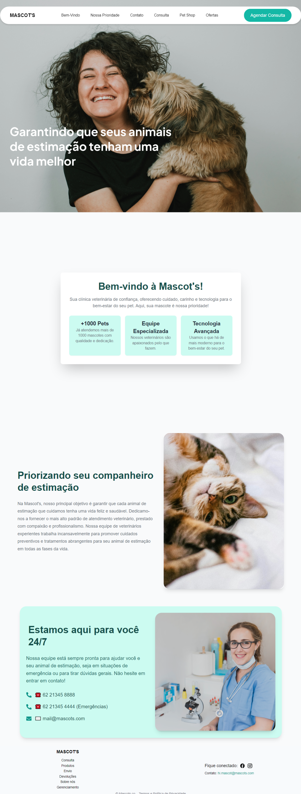
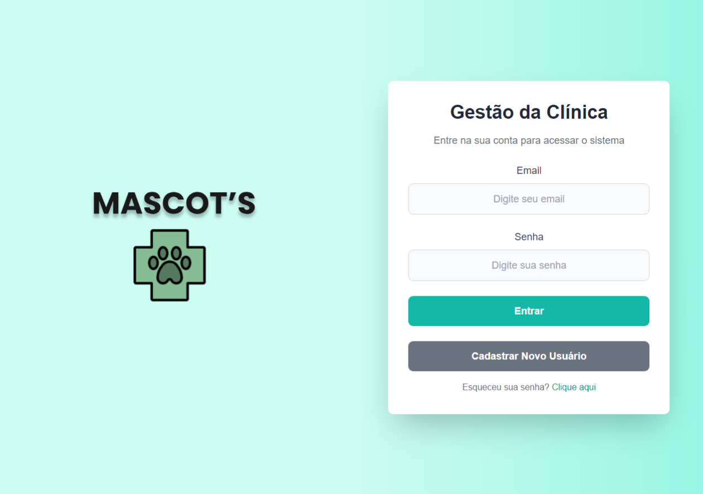
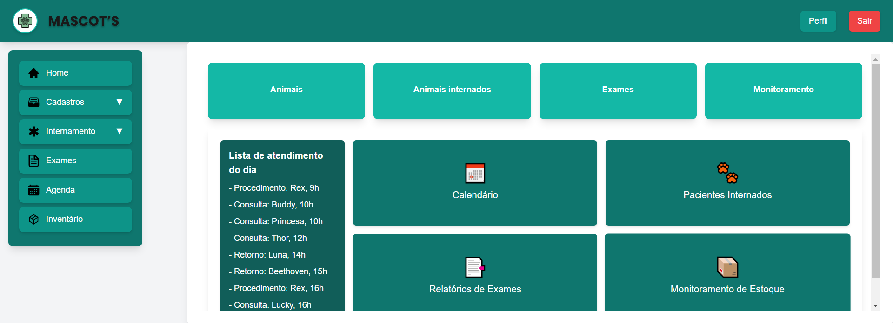

# 🐾 Sistema de Gerenciamento Veterinário

Este é um sistema de gerenciamento para uma clínica veterinária. Ele inclui funcionalidades para a equipe da clínica (veterinários, auxiliares e administradores) e também uma landing page para apresentar informações sobre a clínica. A aplicação foi desenvolvida com os ensinamentos do curso de Front-End React da Softex Pernambuco.

## 📋 Funcionalidades

- **Landing Page:**

  - Apresentação da clínica e seus serviços.
  - Seção de contato.
  - Informações detalhadas sobre os benefícios e diferenciais da clínica.

- **Sistema de Gerenciamento:**
  - **Cadastro e gerenciamento:**
    - Pacientes (animais).
    - Tutores.
    - Estoque de produtos e medicamentos.
  - **Atendimento:**
    - Agendamento de consultas.
    - Internação e administração de medicamentos.
    - Alta de pacientes internados.

## 🚀 Tecnologias Utilizadas

- **Front-end:**

  - React.js
  - TypeScript
  - TailwindCSS

- **Gerenciamento de estado e ferramentas adicionais:**

  - Context API
  - Axios para chamadas à API
  - Biblioteca UUID para gerar identificadores únicos

- **Autenticação e Banco de Dados:**

  - Firebase (para autenticação com o Google e gerenciamento de dados)

## 📄 Utilização de API's

### Rota: Cadastro de Tutor

- **Endpoint:** `POST https://pi-t1-gp2-clinica.onrender.com/pet-owners`
- **Campos obrigatórios:**
  - `owners_cpf`: CPF do tutor.
  - `owners_name`: Nome do tutor.
  - `owners_rg`: RG do tutor.
  - `owners_contact`: Contato do tutor.
  - `owners_adress`: Endereço do tutor.

### Rota: Cadastro de Animal

- **Endpoint:** `POST https://pi-t1-gp2-clinica.onrender.com/pets`
- **Campos obrigatórios:**
  - `pet_name`: Nome do animal.
  - `microchip_code`: Código do microchip.
  - `behavior`: Comportamento do animal.
  - `species`: Espécie do animal.
  - `gender`: Gênero do animal.
  - `age`: Idade do animal.
  - `breed`: Raça do animal.
  - `weight`: Peso do animal.
  - `physical_characteristics`: Características físicas.
  - `allergies`: Alergias do animal.
  - `diseases`: Doenças pré-existentes.
  - `owners_cpf`: CPF do tutor associado.

## 🔄 Exemplos de Fluxos de Interação do Usuário

### Fluxo 1: Cadastro de Pet e Visualização

1. Começando na Landing Page, é possível descer até o Footer e clicar em Gerenciamento.
2. Após isso, abrirá a tela de login para realizar a autenticação, após isso, será redirecionado para a tela de Gerenciamento da clínica.
3. O usuário pode acessar a página de cadastro de pet pela sidebar na página de gerenciamento.
4. Preenche os campos com informações do pet e clica em **Cadastrar**.
5. Após o cadastro, é possível voltar na tela home e acessar a página de visualização de Animais.

### Fluxo 2: Internação e Alta de Pacientes

1. Na página de gerenciamento, o usuário acessa a seção **Internações**.
2. Seleciona um paciente já cadastrado e preenche o formulário de internação, incluindo:
   - Diagnóstico inicial.
   - Medicamentos a serem administrados.
3. Após registrar a internação, o paciente aparece na lista de internados.
4. Quando o paciente recebe alta, o usuário clica em **Dar alta**, preenche os detalhes e confirma a alta.

## 📸 Prints das Telas

### Landing Page



### Tela de Login



### Página de Gerenciamento



---

## 📌 Como rodar o projeto localmente

1. Clone o repositório:
   ```bash
   git clone https://github.com/softexrecifepe/PI-MASCOTS-TURMA-07-EQUIPE-03.git
   ```
2. Instale as dependências:

   ```bash
   cd PI-MASCOTS-TURMA-07-EQUIPE-03

   npm i
   ```

3. Execute o projeto:
   ```bash
   npm run dev
   ```

## Observação

Este é um projeto em desenvolvimento com intuito apenas acadêmico, novas funcionalidades podem ser adicionadas em versões futuras. Sinta-se à vontade para contribuir ou reportar problemas!

## 💻 Equipe de Desenvolvimento

Conheça a equipe responsável por desenvolver o sistema de gestão veterinária:

<table align="center" style="border-collapse: separate; border-spacing: 20px; text-align: center;">
  <tr>
    <td style="border: 2px solid #333333; border-radius: 10px; padding: 15px; background-color: #1e1e1e; box-shadow: 2px 2px 5px rgba(0, 0, 0, 0.5);">
      <a href="https://github.com/DaviLMA" >
        
      </a>
      <br>
      <sub><b>Davi Araújo</b></sub>
      <br><br>
      <a href="https://github.com/DaviLMA">
        
      </a>
      <br><br>
      <a href="https://www.linkedin.com/in/davi-araujo/">
        
      </a>
    </td>
    <td style="border: 2px solid #333333; border-radius: 10px; padding: 15px; background-color: #1e1e1e; box-shadow: 2px 2px 5px rgba(0, 0, 0, 0.5);">
      <a href="https://github.com/claybrrs" >
        
      </a>
      <br>
      <sub><b>Claryssa Barros</b></sub>
      <br><br>
      <a href="https://github.com/claybrrs">
        
      </a>
      <br><br>
      <a href="https://www.linkedin.com/in/claryssa-barros-9b2b3b338/">
        
      </a>
    </td>
    <td style="border: 2px solid #333333; border-radius: 10px; padding: 15px; background-color: #1e1e1e; box-shadow: 2px 2px 5px rgba(0, 0, 0, 0.5);">
      <a href="https://github.com/jonas261007" >
        
      </a>
      <br>
      <sub><b>Jonas</b></sub>
      <br><br>
      <a href="https://github.com/jonas261007">
        
      </a>
      <br><br>
      <a href="#">
        
      </a>
    </td>
    <td style="border: 2px solid #333333; border-radius: 10px; padding: 15px; background-color: #1e1e1e; box-shadow: 2px 2px 5px rgba(0, 0, 0, 0.5);">
      <a href="https://github.com/hudney-fsbrito" >
        
      </a>
      <br>
      <sub><b>Hudney Brito</b></sub>
      <br><br>
      <a href="https://github.com/hudney-fsbrito">
        
      </a>
      <br><br>
      <a href="https://www.linkedin.com/in/hudneyfernandes-dev/">
        
      </a>
    </td>
  </tr>
</table>
